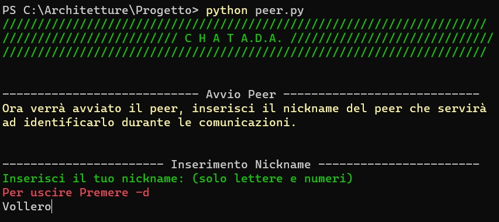
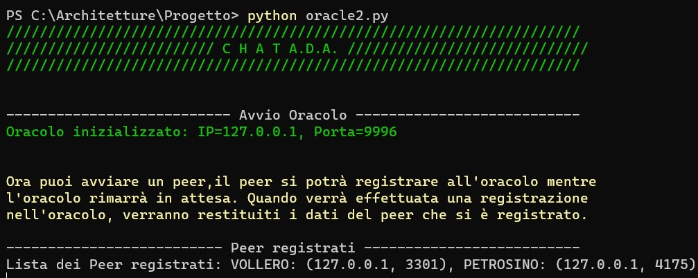
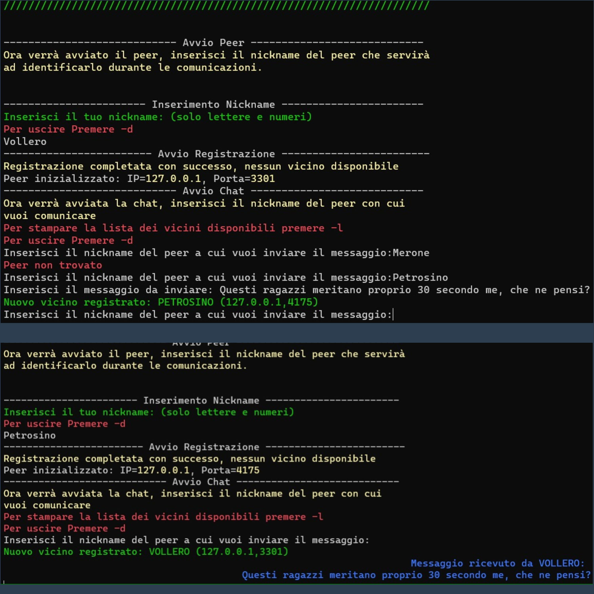
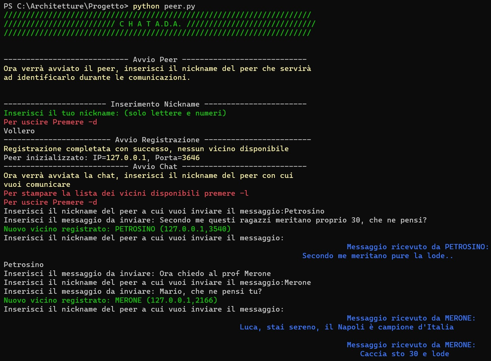

# Rete Peer-to-Peer con Oracoli

Questo repository contiene un'implementazione in Python di una rete peer-to-peer con oracoli. La rete consiste in diversi peer che comunicano tra loro tramite gli oracoli, che fungono da server di registrazione.

## Introduzione
Questo programma implementa una rete Peer-to-Peer (P2P) utilizzando Python. La rete consente ai peer di comunicare tra loro senza la necessità di un server centrale. Ogni peer agisce sia come client che come server, consentendo lo scambio di informazioni dirette tra di loro. Il programma include due classi principali: `Peer` e `Oracle`. La classe `Peer` rappresenta un peer nella rete e si occupa della comunicazione e dell'interazione con altri peer, mentre la classe `Oracle` funge da registro centralizzato per i peer registrati.

## Descrizipne dell'architettura

L'architettura prevede l'utilizzo di tre `Oracle`, ognuno dei quali tiene traccia di tutti i `Peer` che si registrano ad esso. Una volta ricevuta la registrazione, `Oracle` comunica agli altri due oracoli il nuovo `Peer`, in modo tale che tutti gli oracoli mantengano una lista aggiornata dei `Peer`.

Per registrarsi, il `Peer` deve inserire il proprio `nickname`, che può contenere solo caratteri alfanumerici. Una volta registrato, il `Peer` procede a contattare gli altri `Peer` per scambiarsi messaggi.

Nel processo di comunicazione, il `Peer` cerca l'indirizzo del `Peer desiderato` tra i suoi vicini. Nel caso in cui non riesca a trovarlo, il `Peer` chiede ai vicini e, come ultima risorsa, si rivolge all'`Oracle`. Una volta ottenuto l'indirizzo, il `Peer` cripta il messaggio utilizzando un algoritmo di crittografia a chiave asimmetrica (RSA) e aspetta la conferma di avvenuta ricevuta (ACK). Il `Peer` destinatario riceve il messaggio, lo decripta e invia l'ACK di conferma criptato al `Peer` che gli ha inviato il messaggio.

Durante il processo di comunicazione, il `Peer` si impegna nella ricerca dell'indirizzo del `Peer_desiderato` tra i suoi vicini più prossimi. Nel caso in cui tale indirizzo non sia reperibile, il `Peer` si rivolge ai vicini stessi, facendo appello alla loro disponibilità, e, come ultima risorsa, si affida all'`Oracle` per ottenere l'informazione ricercata. Una volta ottenuto l'indirizzo, il `Peer` adotta una strategia di sicurezza avanzata: cripta il messaggio tramite l'utilizzo di un sofisticato algoritmo di crittografia a chiave asimmetrica noto come RSA, rimanendo in attesa dell'importante conferma di avvenuta ricevuta (ACK). Al raggiungimento del destinatario, il messaggio viene decriptato con la massima precisione e accuratezza. Infine, per stabilire la corretta ricezione e comprensione del messaggio, il `Peer_desiderato` invia un'ACK di conferma, a sua volta criptato, al pe`Peer`er mittente.

## Funzionamento

Abbiamo 9 file: `Peer.py`, `Oracle.py`, `Chat.py`, `Query.py`, `Crypto.py`, `Communication.py`, `Setup.py`, `Realignment.py`, `Registration.py`. Il file `Peer.py` contiene la classe `Peer` che serve per creare l'oggetto `peer` con tutti i metodi per la registrazione, la ricezione della comunicazione e l'invio di messaggi. Il metodo `send_message` si occupa dell'invio dei messaggi, il metodo `receive_message` per la ricezione dei messaggi, e infine il metodo `receive_query` riceve le risposte alle query fatte all'oracolo. Viene anche utilizzato un metodo `threading` per avviare 3 thread che gestiranno i metodi.

Poi abbiamo il file `Oracle.py` che contiene la classe `Oracle` che serve per istanziare un oggetto `oracolo` con tutti i suoi metodi per ricevere le query dai peer tramite il metodo `receive_query`, ricevere le registrazioni tramite `receive_from_oracle`, e per avviare i thread che gestiscono le operazioni su `oracle_setup`.

### Schermate Iniziali 


### Registrazione:
#### Parte Peer:
Ora iniziamo a descrivere l'operazione di registrazione. Quando il peer viene istanziato, viene eseguita una funzione chiamata `connection()` a cui viene passato il parametro `-r`, che identifica la registrazione come operazione. All'interno di `connection()`, verrà attivata la parte di codice per il parametro `-r` e verrà chiamata la funzione `register_with_oracle`. Viene quindi creato il messaggio di registrazione che include il nickname e la chiave pubblica del peer creati durante l'istanziazione. Il messaggio di registrazione viene inviato tramite `oracle_socket` alla porta `oracle_ports`, che sarà una tra 9999, 9996 o 9993. Questa porta predefinita verrà assegnata casualmente, in modo che il peer abbia un oracolo predefinito da utilizzare di default per le comunicazioni. Successivamente, il peer si mette in ascolto su `oracle_socket` in attesa della risposta dell'oracolo.

### Esempio di Registrazione



#### Parte Oracolo:
Quando l'oracolo viene istanziato, crea 3 thread come accennato in precedenza: uno con il metodo `receive_query`, uno con `receive_from_oracle` e uno con `receive_registration`. L'oracolo ha la socket `register_socket` sintonizzata, che viene avviata dal thread collegato al metodo `receive_registration`. Questo thread analizza la richiesta e, individuando il flag `-r`, avvia la registrazione. Per prima cosa, il metodo verifica tramite `check_nickname` se il nickname è già stato utilizzato. In caso positivo, viene restituito un messaggio in cui si dice che il peer è già stato utilizzato e il metodo `check_nickname` non restituisce nulla. In caso negativo, viene restituito il nickname e viene registrato in `oracle.peer_list`.

A questo punto ci sono due casi: se all'inizio non ci sono peer registrati, l'oracolo non restituirà nulla con il flag `-pr`; altrimenti restituirà il flag `-r` con una lista di vicini generata da `oracle.peer_list` in modo casuale. `peer_registration` chiama quindi il metodo `send_registration` per aggiornare gli altri oracoli con il nuovo peer che si è aggiunto alla rete. Infine, viene stampata la lista dei peer in `peer_list` nel terminale dell'oracolo.

### Comunicazione:
Ora passiamo a descrivere la comunicazione tra i peer. Dopo la registrazione, quando viene avviata la classe `Peer`, vengono avviati 3 thread che gestiscono i metodi `receive_query`, `receive_message` e `send_message`. I primi due rimangono in ascolto sulle rispettive socket `query_socket` e `peer_socket`, mentre `send_message` utilizza la socket `peer_socket` per inviare messaggi. Prima di avviare l'invio di un messaggio, il metodo `send_message` stampa le istruzioni per inviare messaggi e richiede all'utente a chi si desidera inviare un messaggio. Il metodo imposta la variabile `ack` a False, che servirà per verificare se il messaggio è stato inviato correttamente. Successivamente, vengono chiamati i metodi `get_nick` e `get_address` per recuperare le informazioni necessarie per avviare la comunicazione con il nickname indicato dall'utente in `get_nick`.

Il metodo `get_nick` controlla se il nickname è uguale a quello del mittente del messaggio e, in tal caso, restituisce un messaggio di errore e richiede di inserire un altro nickname, poiché non è possibile inviare messaggi a se stessi. Successivamente, verifica se nell'input vengono inseriti comandi speciali come `-d` e `-l`, che servono rispettivamente per disconnettersi e visualizzare la lista dei vicini disponibili nella `peer_list` del peer. Una volta trovato un nickname valido tramite il metodo `get_address`, vengono recuperate la porta e la chiave pubblica del destinatario del messaggio. Il metodo `get_address` verifica prima se le informazioni sono presenti nella `peer_list`. Se non sono presenti, viene chiamato il metodo `send_query`, che si occupa di cercare le informazioni necessarie per la comunicazione, prima tra i vicini e successivamente chiedendo all'oracolo, in modo da non sovraccaricarlo di richieste.

Il metodo `send_query` invia una richiesta di query ai vicini utilizzando il flag `-q`, che viene gestito dal metodo `query_neighbors`. Viene inviata una richiesta a tutti i vicini del peer tramite la socket `query_socket`, a cui i vicini rimangono in ascolto. I vicini, tramite il thread attivo su `receive_query`, ricevono la richiesta del peer che desidera inviare il messaggio. A questo punto, il vicino gestisce il flag `-q` e utilizza il metodo `peer_query` per cercare nella propria `peer_list` il peer destinatario. Se il peer viene trovato, le informazioni sull'indirizzo e la chiave pubblica del destinatario vengono restituite al peer mittente. Se il peer non viene trovato nella `peer_list`, il vicino richiede le informazioni all'oracolo tramite il metodo `query_Oracle`. Questo metodo scorre le porte degli oracoli e invia una stringa che contiene il tag `-q` e il nickname cercato tramite la socket `oracle_socket`. L'oracolo, tramite il metodo `receive_query`, gestisce la richiesta con il flag `-q` e chiama il metodo `peer_query` per cercare nella propria lista di peer il peer destinatario. Se il peer viene trovato, le informazioni vengono restituite al peer mittente. Se il peer non viene trovato, l'oracolo restituisce tramite il tag `-n` e imposta l'indirizzo come (None, None, None), che viene quindi restituito al metodo `send_message`. A questo punto, viene stampato `Peer non trovato` sul terminale.

Se l'indirizzo viene trovato, l'utente può inserire il messaggio da inviare tramite input. Il messaggio non può superare i 100 caratteri. Successivamente, viene chiamato il metodo `sending`, che ha come parametri il messaggio da inviare e l'indirizzo a cui inviarlo. Questo metodo cripta il messaggio utilizzando il metodo `crypt` e lo invia al peer destinatario tramite la socket `peer_socket`. Il metodo `receive_message`, che rimane sempre in ascolto, prende il messaggio e l'indirizzo del peer mittente e chiama il metodo `receiving`. Questo metodo decifra il messaggio utilizzando il metodo `decrypt` e controlla se il nickname del peer mittente è un suo vicino. Se non lo è, viene chiamato il metodo `ask_key`, che invia una stringa contenente il flag `-k` e il nickname di cui si desidera ottenere la chiave pubblica tramite la socket `oracle_socket`. L'oracolo riceve la query sulla socket `query_socket` nel metodo `receive_query` e chiama il metodo `give_key` per cercare nella propria lista la chiave e inviarla. Una volta ricevuta la chiave, il metodo `receiving` salva il nuovo vicino nella propria lista `peer_list` e lo registra. In entrambi i casi, sia se il peer mittente è un vicino sia se non lo è, il metodo stampa sul terminale il nickname del mittente e il messaggio ricevuto. Infine, viene inviato un ack di conferma di ricezione sulla socket `peer_socket` tramite il metodo `send_ack`, che viene ricevuto dal peer mittente tramite il metodo `receiving_ack`.

### Esempio di comunicazione



### Comunicazione a 3 Peer



>Altre immagini dimostrative sono nella cartella Foto

## Componenti

## Classe Oracle

I file `Oracle1.py`,`Oracle2.py`,`Oracle3.py` contengono l'implementazione della classe `Oracle`, che rappresenta il server dell'oracolo nella rete P2P. L'oracolo funge da registro centralizzato per i peer registrati e gestisce le richieste di registrazione e query.

La classe `Oracle` ha i seguenti metodi principali:

- `__init__(self, nick, ip, port)`: Il metodo di inizializzazione dell'oracolo. Imposta l'indirizzo IP, la porta e il nickname dell'oracolo, oltre a creare i socket necessari per la comunicazione con i peer.

- `receive_query(self)`: Gestisce la ricezione delle query dai peer. Ascolta i messaggi inviati alla socket `query_socket` dell'oracolo e smista le query ai peer corrispondenti.

- `receive_from_oracle(self)`: Gestisce la ricezione dei messaggi provenienti dagli altri oracoli. Ascolta i messaggi inviati alla socket `communication_socket` dell'oracolo e gestisce le registrazioni e le disconnessioni dei peer nella rete.

- `receive_registration(self)`: Gestisce la ricezione delle registrazioni e disconnessioni dei peer. Ascolta i messaggi inviati alla socket `registr_socket` dell'oracolo e aggiorna la lista dei peer registrati.

- `oracle_setup(self)`: Inizializza l'oracolo, avviando i thread per la gestione delle query, dei messaggi provenienti dagli altri oracoli e delle registrazioni dei peer.

## Classe Peer

Il file `Peer_Lez_Cappa.py` contiene l'implementazione della classe `Peer`, che rappresenta un peer nella rete P2P. Ogni peer viene assegnato un indirizzo IP e un numero di porta casuali e si registra presso gli oracoli per unirsi alla rete.

La classe `Peer` ha i seguenti metodi principali:

- `__init__(self, nick, ip, port, oracle_port)`: Il metodo di inizializzazione del peer. Imposta l'indirizzo IP, la porta e il nickname del peer, oltre a creare i socket necessari per la comunicazione con l'oracolo e i vicini.

- `send_message(self)`: Gestisce l'invio dei messaggi da parte del peer. Chiede all'utente di inserire il messaggio da inviare e lo invia ai vicini corrispondenti.

- `receive_query(self)`: Gestisce la ricezione delle query dai vicini. Ascolta i messaggi inviati alla socket `query_socket` del peer e risponde alle query in base alla propria lista di vicini.

- `receive_message(self)`: Gestisce la ricezione dei messaggi dai vicini. Ascolta i messaggi inviati alla socket `peer_socket` del peer e visualizza i messaggi ricevuti.

- `become_oracle(self)`: Implementa la logica per diventare un oracolo nella rete. È incompleto e richiede ulteriori implementazioni.

- `threading(self)`: Inizializza il peer, avviando i thread per la gestione delle query, dei messaggi dai vicini e per l'invio dei messaggi.

Entrambe le classi hanno anche altri metodi ausiliari per supportare le funzionalità principali.


### chat.py 
> metodi per l'invio e ricezione dei messaggi
### communication.py 
> metodi per la comunicazioni tra gli oracoli
### query.py 
> metodi per la richiesta dell'indirizzo
### registration.py 
> metodi che servono per la gestione della registrazione
### realignment.py 
> riallineamento degli oracoli
### crypto.py 
> si occupa dei della criptazione dei messaggi
### setup.py 
> ci sono metodi che servono per l'inizializzaione del peer/orac
### interface.py 
> si occupa della gestione dell'interfaccia

# Avvio Progetto

## Clonare il repository: 
```
git clone https://github.com/antoniospadea/Chat-Distribuita.git

```
## Creare ed attivare un ambiente virtuale: 
```
python -m venv ChatP2P_ambiente_virtuale

source nome_ambiente_virtuale/bin/activate

```
## Installare le dipendenze
```
pip install -r requirements.txt

```

## Avviare i tre Oracoli
Per avviare i tre `Oracoli` aprire 3 terminali nella `directory` del progetto. Avviare i file `Oracle1.py`, `Oracle2.py`, `Oracle3.py` su 3 terminali diversi, con i seguenti comandi
>Terminale 1
```
python Oracle1.py
```
>Terminale 2
```
python Oracle2.py
```
>Terminale 3
```
python Oracle3.py
```
Per avviare un `Peer` apri un terminale nella `directory` del progetto e esegui il seguente comando per avviare il file `Peer.py`
```
python Peer.py
```
# Requisiti

- Python 3.x
- pyasn1==0.5.0
- rsa==4.9

# Contributi
Sono benvenuti contributi a questo progetto. Se si riscontrano problemi o si hanno suggerimenti per miglioramenti, è possibile aprire una segnalazione o inviare una richiesta di modifica.

